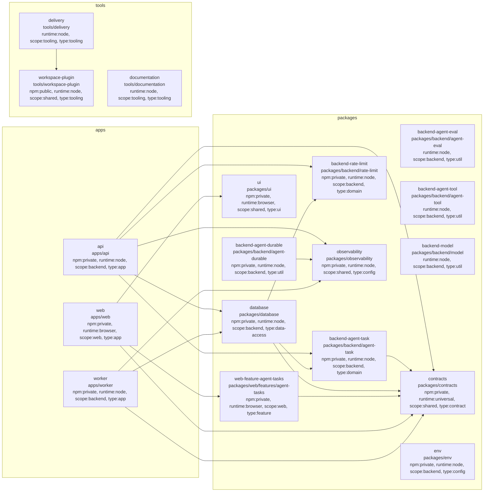

# Nx project graph

<!-- Generated by `pnpm docs:architecture`. Do not edit this file manually. -->

This diagram is generated from the Nx project graph and validates the documented project inventory and dependency direction.



Regenerate after adding, removing, retagging, or rewiring an Nx project:

```bash
pnpm docs:architecture
```
