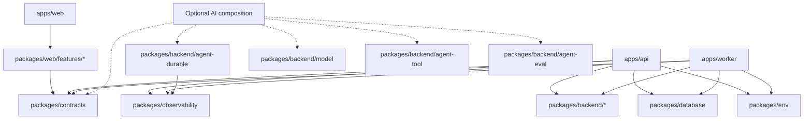
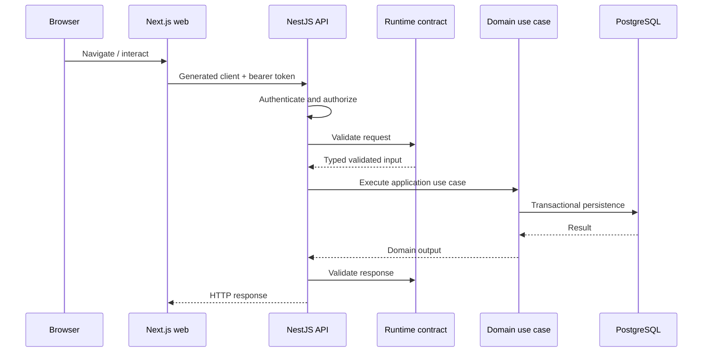
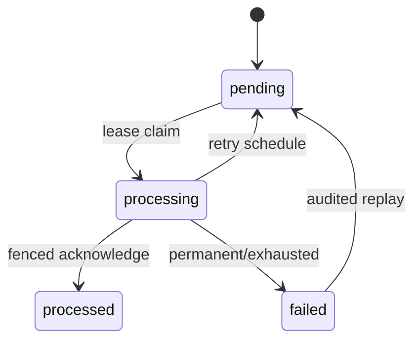

# Architecture

This page explains the system structure and the executable guardrails that let humans and AI agents change it safely, including request flow, data ownership, background delivery, rate limiting, observability, containers, optional runtime AI boundaries, and enforced dependencies.

## Prerequisites

- Basic familiarity with TypeScript web applications and PostgreSQL is helpful but not required.

## The problem the platform solves

A full-stack product built across many agent sessions needs consistent boundaries across browser code, HTTP contracts, domain behavior, persistence, asynchronous work, configuration, validation, and delivery. The repository uses Nx projects as explicit units of ownership and dependency control so a contributor can discover the correct location and invalid changes fail mechanically instead of depending on remembered conventions.

## Nx monorepo organization

Nx provides:

- project graph and dependency analysis
- cached targets
- affected-only validation
- project generators
- project tags and ESLint-enforced boundaries
- synchronized TypeScript project references

Applications are composition roots. Reusable behavior belongs in libraries.

## Architecture as executable agent guidance

The architecture is intentionally represented in forms an agent can inspect and tools can enforce:

- project tags express scope, runtime, and architectural type;
- Nx exposes the dependency graph and affected projects;
- ESLint rejects forbidden dependency directions;
- TypeScript project references keep project boundaries explicit;
- public barrels define supported cross-project APIs;
- generated contracts prevent transport-shape duplication;
- generators create correctly tagged structures;
- root and nested `AGENTS.md` files explain local design intent.

Written diagrams explain the model. The executable checks determine whether a proposed change conforms to it.



The dashed AI edges represent reusable optional boundaries that are present in the upstream source but are not composed into the default web/API/worker applications.

## Synchronous request flow



HTTP types originate in the OpenAPI source. Generated runtime Zod validators reject malformed requests and validate responses at the presentation boundary. Domain code remains transport-independent.

## Web application

The web application uses Next.js App Router. Route files should compose feature packages rather than own reusable product logic. Browser features use generated clients and cannot import Node-only projects. Server components are preferred until an interaction boundary requires a client component.

The reference browser authentication adapter stores short-lived API access tokens only in memory.

## API

The API is a NestJS composition root. It owns controllers, guards, module wiring, health endpoints, and adapter composition. It does not own domain models or database table types.

Authentication and authorization are separate:

- authentication verifies the access token and creates a principal
- authorization maps route metadata and permissions
- domain/application use cases enforce actor-scoped data rules

## Shared contracts

`packages/contracts` has two major responsibilities:

1. HTTP contract source and generated browser/server artifacts.
2. Versioned asynchronous event schemas.

It also contains the optional V1 browser agent-stream contract used by the Agent Tasks web feature. That protocol is a reusable transport boundary only; the default API does not expose a model-backed streaming endpoint.

Generated artifacts are checked for drift and compatibility. Consumers must not duplicate request/response DTOs by hand.

## Optional runtime AI boundaries

Phase 14 adds reusable AI-facing libraries without turning the default applications into an AI product:

- `packages/backend/model` defines provider-neutral generation, structured-output, embedding, and streaming through `ModelClient`. It includes an OpenAI adapter implemented with native `fetch` and a deterministic no-network adapter.
- `packages/backend/agent-tool` defines typed tool invocation with runtime input/output validation and mandatory invocation-time authorization against the authenticated application actor.
- `packages/contracts/src/agent-stream` defines strict versioned NDJSON browser events that preserve trace, actor, conversation, provider, model, tool, and tool-call identifiers without exposing raw prompt or tool payload fields.
- `packages/backend/agent-eval` defines reviewed prompt/tool-instruction artifacts, deterministic and application-supplied grading boundaries, quality/latency/token/cost budgets, and CI-enforced evidence manifests.
- `packages/backend/agent-durable` defines a replaceable durable-run adapter with renewable lease/fence semantics, ordered idempotent checkpoints, atomic approval pauses, resume/rejection transitions, interruption recovery, and payload-safe lifecycle observation through the shared correlation context.

These projects are backend/shared primitives, not composition roots. Provider/model selection remains server-side and allowlisted. Secrets and authentication material must not be sent to providers, and sensitive or residency-constrained data requires explicit application policy. Model output is never an authorization decision or a human approval decision.

The durable project's in-memory adapter is deterministic test support only. Production checkpoint state requires an application-selected persistent adapter plus explicit ownership, retention, deletion, tenant isolation, encryption/access control, backup/restore, and regional policy.

The `ai` workspace profile remains default-off and does not yet generate a runnable model-backed workflow. Broader safety/governance and fallback policy are next; generated AI-profile composition remains later Phase 14 work. See [Optional AI Runtime](Optional-AI-Runtime).

## Database and migrations

PostgreSQL is the durable baseline. `packages/database` owns:

- schema and migrations
- migration status and reset tooling
- repositories implementing domain ports
- transactional outbox storage and delivery state
- PostgreSQL rate-limit counters

The Agent Task create use case writes the task and outbox event in one transaction, preventing a committed task from losing its execution request.

P14-05 deliberately does not add durable-agent tables to this default schema. An application that opts into durable agent execution chooses and composes a production `DurableExecutionAdapter` explicitly.

## Worker delivery and outbox behavior



Delivery is at least once. A worker claims rows with a lease and ownership token. The outbox row ID is the idempotency identity; receive count is the execution fence. Duplicate terminal delivery is a no-op. A stale worker cannot acknowledge work owned by a newer lease.

Optional durable runs deliberately reuse that ownership model: expired run leases can be reclaimed with a higher fence, and an older run session cannot overwrite newer checkpoint or terminal state.

This design handles process crashes without requiring exactly-once transport.

## Authentication boundaries

Local development uses a deterministic verifier. Production uses OIDC access-token verification. Browser OIDC/session profiles call a same-origin secure-session endpoint for short-lived access tokens. The repository supplies the verifier and credential adapter, not provider-specific login routes.

## Rate limiting

Local development uses a bounded in-memory adapter. Production uses atomic PostgreSQL fixed-window counters shared by API replicas.

Policies include anonymous, authenticated subject, route, and optional tenant limits. Store keys contain hashes, not raw identity or route values. PostgreSQL failure returns `503 rate_limit_unavailable`; the API does not fall back to per-process counters.

## Observability

The repository provides structured logging, OpenTelemetry traces/metrics, health endpoints, and worker metrics. Local telemetry is optional through the Compose collector. Production teams own exporter credentials, sampling, redaction, retention, dashboards, alerts, and support.

Optional AI composition should preserve identifier-oriented observability by default. Durable lifecycle events reuse the existing correlation context and omit checkpoint state. Do not log raw prompts, completions, retrieved sensitive context, checkpoint payloads, tool arguments, or tool results merely to make model behavior easier to inspect.

## Containers and preview architecture

The node services use a shared multi-stage Dockerfile; the web uses Next.js standalone output. Runtime images run as the unprivileged `node` user.

The preview stack starts PostgreSQL, applies migrations outside application startup, then starts API, worker, and web with health checks. It is production-shaped but remains local Compose, not a production deployment.

## Boundary enforcement

The current tag matrix allows:

```text
scope:shared  -> scope:shared
scope:web     -> scope:web | scope:shared
scope:backend -> scope:backend | scope:shared

runtime:browser -X-> runtime:node

type:app      -> domain | feature | job | ui | contract | config | data-access | util
type:domain   -> domain | contract | util
type:feature  -> ui | contract | util
type:job      -> domain | contract | config | data-access | util
type:ui       -> ui | contract | util
type:contract -> contract | util
type:config   -> config | contract | util
```

Do not weaken a boundary to make one import pass. Move behavior to the correct project or document a deliberate architecture change.

## Out of the box versus adopter responsibility

| Area           | Out of the box                                                | Adopter responsibility                                                                                                           |
| -------------- | ------------------------------------------------------------- | -------------------------------------------------------------------------------------------------------------------------------- |
| Web/API/worker | Reference applications and composition                        | Product behavior and scaling                                                                                                     |
| Contracts      | Generation, runtime validation, agent-stream V1               | API/protocol lifecycle and compatibility decisions                                                                               |
| PostgreSQL     | Local Compose, migrations, adapters                           | Managed service, TLS, capacity, backups                                                                                          |
| Authentication | Development verifier, OIDC verifier, browser adapter          | Provider login/session integration and operations                                                                                |
| Worker         | PostgreSQL outbox baseline                                    | Capacity, alerting, business handlers                                                                                            |
| Rate limits    | Memory local, PostgreSQL production adapter                   | Thresholds and ingress trust                                                                                                     |
| Telemetry      | Instrumentation and local collector                           | Backend, retention, redaction, dashboards                                                                                        |
| Optional AI    | Model/tool/stream/evaluation/durable lifecycle primitives     | Runtime composition, provider policy, credentials, data handling, durable storage, safety/governance, monitoring                 |
| Deployment     | Images, preview, release plan                                 | Real platform, ingress, DNS, TLS, rollout                                                                                        |

## Related pages

- [Agentic Development Model](Agentic-Development-Model)
- [Repository Tour](Repository-Tour)
- [Optional AI Runtime](Optional-AI-Runtime)
- [Authentication and Authorization](Authentication-and-Authorization)
- [Worker and Background Jobs](Worker-and-Background-Jobs)

## Next steps

1. [Optional AI Runtime](Optional-AI-Runtime)
2. [Authentication and Authorization](Authentication-and-Authorization)
3. [Database and Data Management](Database-and-Data-Management)

[Back to Home](Home)
