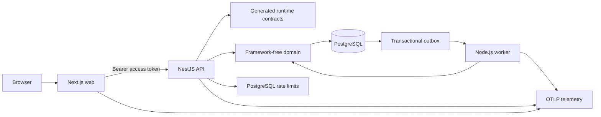

# SteadyStack

SteadyStack is a production-minded TypeScript web-application template designed to become the foundation for many different products that are built and maintained substantially by AI and coding agents under human ownership.

The workspace includes a Next.js web application, NestJS API, PostgreSQL-backed worker, shared contracts, validated configuration, deterministic generators, and production-shaped delivery controls in one Nx monorepo. Its defining goal is not simply to provide these technologies together. It is to make the repository legible, constrained, and verifiable enough that an agent can enter with no prior conversation history, find the correct change boundary, create approved structure, receive fast feedback, and produce a reviewable handoff.

> **Important:** Agentic-compatible development is a repository operating model, not an AI feature in the product. The optional `--ai=true` profile selects generated product AI capabilities; it is unrelated to whether coding agents can work effectively in the repository.

> **Production warning:** A generated workspace that starts locally, passes validation, or was largely implemented by agents is **not automatically production-ready**. The adopting team must still own identity-provider integration, production data services, secrets, telemetry, deployment infrastructure, risk acceptance, rollback, disaster recovery, and operational support.

## Primary design goal

The template makes the preferred engineering path explicit and executable:

- layered `AGENTS.md` files tell contributors and agents which always-on rules apply near the code;
- `.agents/skills/<name>/SKILL.md` provides canonical progressively disclosed procedures, with `.agents/skills/provenance.json` recording reviewed origin and complete-tree integrity;
- the Nx project graph and project tags expose ownership and dependency direction;
- `.mcp.json` makes Nx workspace context available to compatible agent clients;
- local generators create domains, features, jobs, and contracts with approved structure;
- ESLint, TypeScript, generated-contract checks, documentation integrity, and `pnpm agent-skills:check` enforce boundaries and agent-procedure provenance;
- focused Nx targets and affected commands provide fast iteration;
- `pnpm check`, preview validation, production gates, and release evidence provide objective completion criteria;
- versioned template provenance and ownership-aware upgrades support long-lived generated projects.

Portable skills supplement rather than replace repository authority. Root and closest nested `AGENTS.md`, executable contracts and generated sources of truth, ADRs and `docs/TODO.md`, protected controls, and human approval remain authoritative. P15-02 distributes the canonical skill tree into initialized products and verifies that maintained agent hosts discover the same `.agents/skills` root without vendor-specific copies.

Read [Agentic Development Model](Agentic-Development-Model) before establishing an agent-led workflow.

## What the platform includes

### Agent-facing repository controls

- Root and subsystem-specific `AGENTS.md` guidance.
- Canonical `.agents/skills/<name>/SKILL.md` procedures plus `.agents/skills/provenance.json` for origin, license, script-review state, and content hashes in the upstream template and initialized products.
- Nx project graph, caching, affected commands, architectural tags, and MCP configuration.
- Deterministic workspace initialization and local structural generators.
- Stable root commands for formatting, testing, validation, preview, and upgrades, including the blocking `pnpm agent-skills:check` gate.
- Generated contracts with drift and compatibility checks.
- Versioned template provenance, migration tooling, and file-ownership policy.

P15-02-generated products preserve the validated portable skill set byte-for-byte through identity initialization, including the release-evidence and downstream-upgrade procedures. The same `pnpm agent-skills:check` command validates the generated registry and maintained-host discovery contract.

### Application and operational foundation

- A Next.js App Router web application.
- A NestJS HTTP API with generated runtime contract enforcement.
- A Node.js worker that consumes a PostgreSQL transactional outbox.
- Framework-free Agent Task and rate-limit libraries.
- Shared UI, contracts, PostgreSQL migrations, environment validation, and observability.
- Production OCI image builds, a local preview stack, smoke tests, performance budgets, SBOMs, vulnerability policy, signatures, attestations, immutable release manifests, finalized release-record evidence, and production configuration validation.
- Optional, default-off AI runtime primitives for provider-neutral model access, typed authorized tools, versioned browser streaming, reviewed prompt/evaluation evidence, replaceable durable execution, and safety/governance hooks with bounded compatible fallback.
- An `ai=true` generated API reference profile that composes those Phase 14 boundaries with deterministic tests while leaving provider SDKs and production infrastructure optional.

## What it does not include

The template does not provide:

- a hosted coding-agent service, a default LLM choice, or an autonomous production operator;
- organization-specific agent credentials or permission policy;
- an organization-specific cloud deployment or Kubernetes manifests;
- identity-provider login, callback, and logout implementation;
- a production session store or Redis worker adapter;
- a composed model-backed application in the **default** profile, a default model provider, provider credentials, or a selected production durable-agent persistence adapter;
- production backups, DNS/TLS, dashboards, alert routing, or incident ownership.

Selecting `ai=true` generates and tests a provider-neutral reference workflow under the API, but adopters still choose production providers/credentials, durable persistence, concrete data and tool policy, operational budgets, monitoring, and incident ownership. See [Optional AI Runtime](Optional-AI-Runtime).

Supported profiles can record some product or platform directions without implementing them; the optional AI profile is now an implemented generated profile rather than metadata-only intent.

## Start here

1. [Understand the Agentic Development Model](Agentic-Development-Model), including the standard agent workflow and human approval boundaries.
2. [Choose workspace profiles](Choosing-Workspace-Profiles) for applications, authentication, worker delivery, telemetry, deployment, and the optional generated product AI profile.
3. If you select or extend runtime AI behavior, read [Optional AI Runtime](Optional-AI-Runtime) for the default-off boundary, generated reference workflow, model/tool contracts, streaming protocol, evaluation evidence, durable execution, safety/governance, and production replacement points.
4. [Complete the Quick Start](Quick-Start) to create, initialize, map, run, and validate a local workspace.
5. [Tour the repository](Repository-Tour) and inspect its Nx project graph.
6. [Learn everyday development](Everyday-Development), [code generation](Code-Generation), and [validation](Validation-and-Testing).
7. Review [Production Readiness](Production-Readiness) before connecting shared or production environments.

## Current roadmap status

Roadmap status is mirrored from the repository's authoritative [`docs/TODO.md`](https://github.com/kaleigh-dem/steady-stack/blob/main/docs/TODO.md); the wiki does not maintain an independent task ledger.

- **Phase 13 — completed baseline plus maintenance:** P13-01 through P13-07 are complete; ongoing dependency and security maintenance continues through the repository's normal workflows.
- **Phase 14 — complete and optional:** P14-01 through P14-07 are complete. The repository has the optional profile boundary, provider-neutral model interfaces and adapters, typed authorized tools plus V1 agent streaming, reviewed prompt/evaluation evidence, replaceable durable-run checkpoint/approval/recovery primitives, reusable safety/governance hooks, and `ai=true` generated reference composition with exact-head generated-workspace validation. `ai=false` remains the default and is validated to contain no model-provider runtime dependencies.
- **Phase 15 — active portable agent ergonomics:** **P15-01 and P15-02 are complete.** The repository has the canonical `.agents/skills` contract, reviewed provenance, architecture-discovery and validation/debugging procedures, generated release-evidence and downstream-upgrade procedures, byte-preserved generation into initialized products, and deterministic maintained-host discovery evidence for GitHub Copilot and OpenAI Codex. **P15-03 is the remaining roadmap task.**

Use `docs/TODO.md` for sequencing, acceptance criteria, and future status changes.

## SteadyStack identity

PR #61 established the SteadyStack public identity across the repository, package scope, plugin, upgrade executable, release artifact, generated-workspace provenance, workflows, and documentation. New workspaces use `kaleigh-dem/steady-stack`, while generated products choose and retain their own application identity.

The repository had no released generated users before SteadyStack became the canonical public identity, so the end-user wiki documents only the current names. Historical rename notes remain in `docs/steadystack-migration.md` for maintainers.

## Common tasks

| Task                                                    | Page                                                                       |
| ------------------------------------------------------- | -------------------------------------------------------------------------- |
| Establish an agent-led development workflow             | [Agentic Development Model](Agentic-Development-Model)                     |
| Create and run a workspace                              | [Quick Start](Quick-Start)                                                 |
| Select initialization profiles                          | [Choosing Workspace Profiles](Choosing-Workspace-Profiles)                 |
| Understand apps, packages, and agent instructions       | [Repository Tour](Repository-Tour)                                         |
| Run focused and affected development commands           | [Everyday Development](Everyday-Development)                               |
| Generate domains, features, jobs, and contracts         | [Code Generation](Code-Generation)                                         |
| Understand the executable architecture                  | [Architecture](Architecture)                                               |
| Compose or evaluate optional runtime AI capabilities    | [Optional AI Runtime](Optional-AI-Runtime)                                 |
| Configure identity                                      | [Authentication and Authorization](Authentication-and-Authorization)       |
| Manage PostgreSQL and migrations                        | [Database and Data Management](Database-and-Data-Management)               |
| Operate background jobs                                 | [Worker and Background Jobs](Worker-and-Background-Jobs)                   |
| Understand `pnpm check` and agent feedback loops        | [Validation and Testing](Validation-and-Testing)                           |
| Diagnose retained CI failure evidence                   | [CI Diagnostics](CI-Diagnostics)                                           |
| Build and test production-shaped images                 | [Containers and Preview Environments](Containers-and-Preview-Environments) |
| Verify image SBOMs, scans, signatures, and attestations | [Image Supply Chain](Image-Supply-Chain)                                   |
| Configure repository controls and agent permissions     | [Repository and GitHub Setup](Repository-and-GitHub-Setup)                 |
| Prepare for launch                                      | [Production Readiness](Production-Readiness)                               |
| Finalize release evidence or upgrade a generated repo   | [Releases and Upgrades](Releases-and-Upgrades)                             |
| Diagnose a failure                                      | [Troubleshooting](Troubleshooting)                                         |

## By role

### Evaluating the template

Read [Agentic Development Model](Agentic-Development-Model), [Architecture](Architecture), [Repository Tour](Repository-Tour), and [Choosing Workspace Profiles](Choosing-Workspace-Profiles). If runtime AI matters to the product, also review [Optional AI Runtime](Optional-AI-Runtime).

### Creating an agent-led product workspace

Follow [Quick Start](Quick-Start), customize the root and nested agent guidance for the product, then complete [Repository and GitHub Setup](Repository-and-GitHub-Setup).

### Developing applications

Use [Everyday Development](Everyday-Development), [Code Generation](Code-Generation), [Validation and Testing](Validation-and-Testing), and the root plus closest nested `AGENTS.md` files. Generated products contain the canonical `.agents/skills` procedures; load the relevant skill when its task matches. For model/tool/prompt/durable/governance-runtime changes, also follow [Optional AI Runtime](Optional-AI-Runtime) and the applicable evaluation, data-retention, policy, authority, and fallback boundaries.

### Configuring infrastructure

Use [Authentication and Authorization](Authentication-and-Authorization), [Database and Data Management](Database-and-Data-Management), [Containers and Preview Environments](Containers-and-Preview-Environments), [Image Supply Chain](Image-Supply-Chain), and [Production Readiness](Production-Readiness).

### Operating production

Use [Worker and Background Jobs](Worker-and-Background-Jobs), [Image Supply Chain](Image-Supply-Chain), [Production Readiness](Production-Readiness), [Releases and Upgrades](Releases-and-Upgrades), and [Troubleshooting](Troubleshooting). Agents may prepare evidence and draft procedures; accountable operators approve and execute production decisions.

## Agent and human operating model

```mermaid
flowchart LR
  Intent[Human intent and acceptance criteria] --> Agent[Human or AI implementation agent]
  Agent --> Context[AGENTS.md + relevant .agents/skills + Nx graph + ADRs + contracts]
  Context --> Change[Generators + scoped code changes]
  Change --> Feedback[Focused Nx targets + affected checks]
  Feedback --> Contract[pnpm check + preview + release evidence]
  Contract --> Review[Human review and approval]
  Review --> Product[Generated product repository]
```

The repository supplies the context and guardrails. Agents can explore, generate, implement, test, and prepare evidence. Skills are progressively disclosed procedures, not a source of authority. Humans remain responsible for product intent, architecture exceptions, access policy, production risk, and operational approval.

## Application system overview

The web application obtains an access token through the configured browser authentication adapter and calls the API through generated client code. The API validates transport contracts, authenticates and authorizes the request, executes framework-free application behavior, and writes application data plus outbox events transactionally. The worker leases outbox records, executes handlers at least once, and uses fencing and idempotency to make duplicate or stale delivery safe.

In the default profile, optional AI primitives sit outside this request/data flow. Selecting `ai=true` generates a reference API composition that demonstrates how to connect those primitives without making them mandatory for ordinary workspaces.

## Source of truth

The wiki reorganizes end-user guidance from the repository implementation and maintained documentation. When a wiki statement conflicts with code, use the implementation and open a documentation correction. The [Documentation Audit](Documentation-Audit) records command verification, source mapping, discrepancies, and known gaps.

## Next steps

1. [Agentic Development Model](Agentic-Development-Model)
2. [Choosing Workspace Profiles](Choosing-Workspace-Profiles)
3. [Optional AI Runtime](Optional-AI-Runtime)
4. [Quick Start](Quick-Start)
